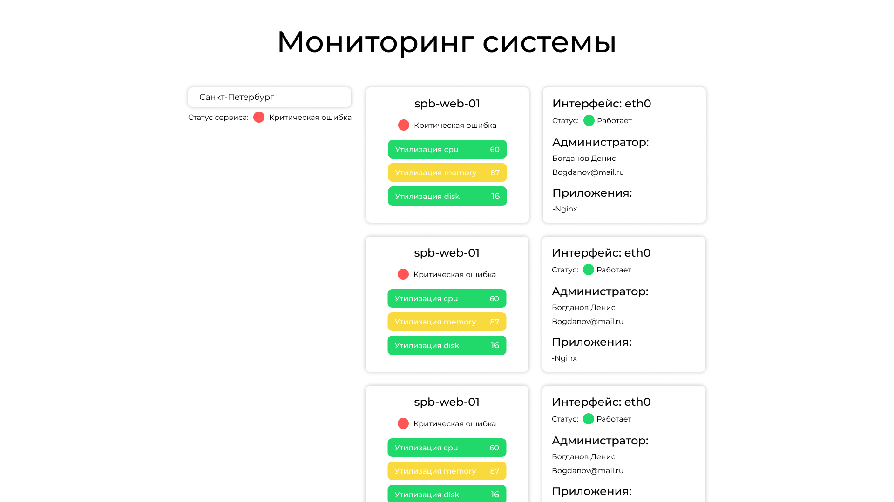
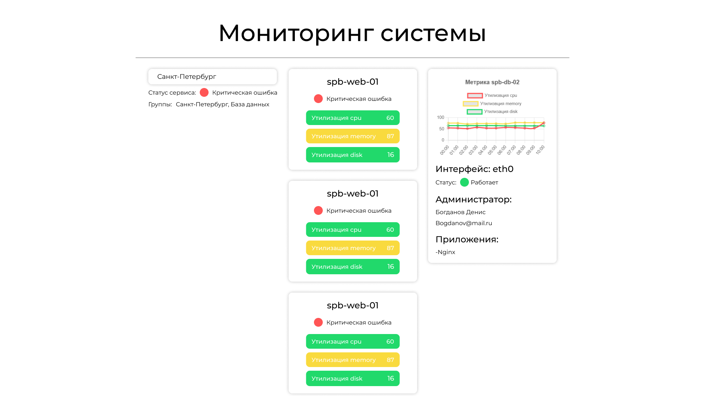
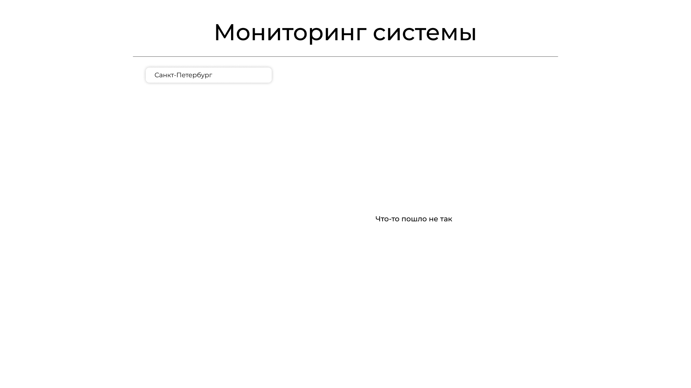

# 📊 Мониторинг системы

Полноценное веб-приложение для мониторинга инфраструктуры: отображает статус групп, нод, интерфейсов, метрик, администраторов и приложений. Интерфейс разбит на логические блоки с удобной фильтрацией и визуализацией данных.

---

## Технологический стек

### Backend
- **Node.js** и **Express** - серверная часть
- **SQLite3** - хранение данных
- **REST API** - взаимодействие с фронтендом

### Frontend
- **React** + **Vite** - клиентская часть
- **Redux Toolkit** - управление состоянием
- **Chart.js** - визуализация метрик
- **React ChartJS 2** - интеграция графиков
- **Classnames** - условные стили

## Дизайн интерфейса




Макеты интерфейса доступны в Figma: 
[](https://www.figma.com/design/U0BBikQZmHw8tN0hhZHmHU/Untitled?node-id=0-1&t=kdW5X9Cg9uhqRX9l-1)

## Установка и запуск

### Backend
```bash
cd backend
npm install
npm start

## Frontend
cd frontend
npm install
npm run dev


